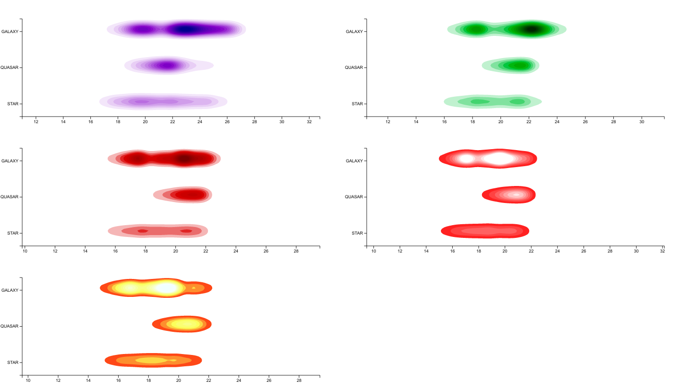
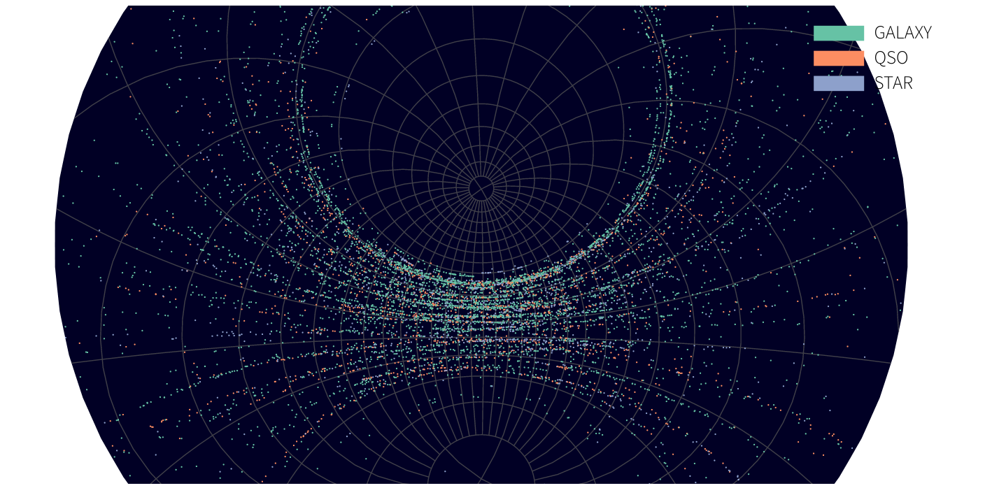

# Stellar Object Observation
## Observations of Stellar Classes Through Sloan Digital Sky Survey by Rowan Miner
## What is SDSS?
### The Sloan Digital Sky Survey or SDSS is a major multi-spectral imaging and spectroscopic redshift survey using a dedicated 2.5-m wide-angle optical telescope at Apache Point Observatory in New Mexico, United States. has created the most detailed three-dimensional maps of the Universe ever made, with deep multi-color images of one third of the sky, and spectra for more than three million astronomical objects.
## Stellar Objects Covered in These Visualizations
### Quasars: A quasar is an extremely luminous active galactic nucleus, powered by a supermassive black hole, with mass ranging from millions to tens of billions of solar masses, surrounded by a gaseous accretion disc.

### Galaxies: Vast cosmic islands of stars, gas, dust, and dark matter held together by gravity.

### Star: An astronomical object comprising a luminous spheroid of plasma held together by its gravity

# Filters
SDSS uses five filters to take in measurements of Ultraviolet, Green, Red, Near-Infrared, and Infrared light that is given off by a stellar object
The SDSS has adopted a modified form of the Petrosian (1976) system due to the difficulty in measuring flux in galaxies since they do not all have the same radial surface brightness profile and have no consistently distinct edges.

# RedShifting in Quasars and Galaxies
## What is RedShifting?
Redshifting occurs when we observe an object moving away from us and the wavelengths of light stretch shifting the spectrum towards the red end of the light spectrum. These values range from 0-7 from the survey
What is Right Ascention Angle?
Right ascension, in astronomy, the east–west coordinate by which the position of a celestial body is ordinarily measured (much like longitude); more precisely, it is the angular distance of a body's hour circle east of the vernal equinox, measured along the celestial equator.

# Interactive Map
 A limited view of the SDSS dataset, users can drag and move globe to see where each object was scanned in the sky.
 
